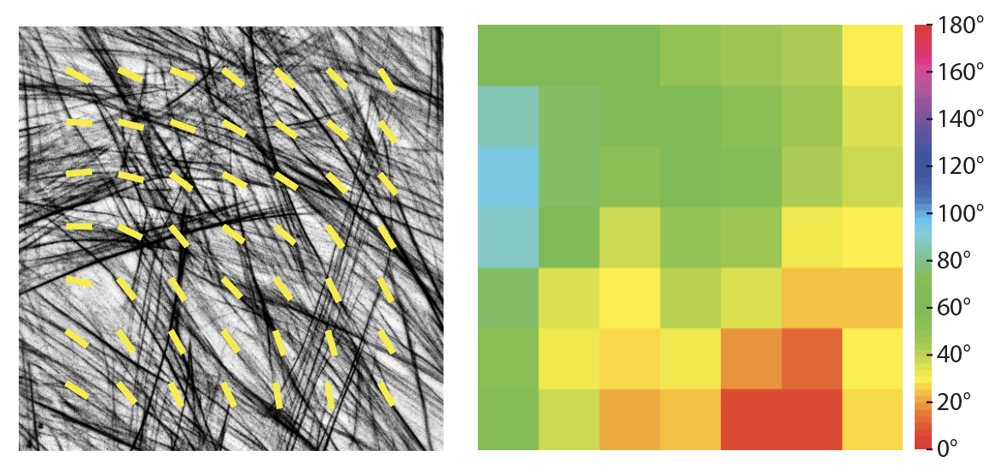
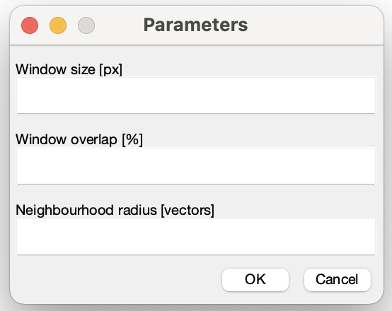
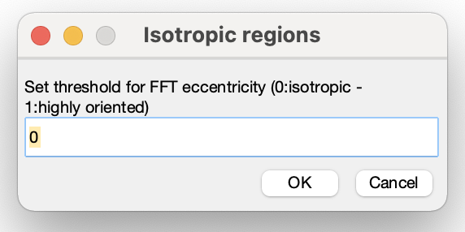

# AFT - Alignment by Fourier Transform (MATLAB)

## Usage
Download the repository on your local machine. In MATLAB, set the Current Folder to the downloaded repo, open the required script and hit Run.

## `AFT_batch.m`
This routine uses a vector field of alignment directions using small sub-windows in the real space image to calculate an alignment order parameter. It calls the functions `AFT_function.m`, `user_input.m`, `periodic_decomposition.m`, `AFT_anglemat.m`, and `AFT_ordermat.m`.
  * _Input_: a folder containing grayscale images in .tif format (white signal over black background)

  

  * _Output_: everything is saved in an automatically created sub-folder called `output`
    * an array containing an alignment order parameter averaged across each image (`median_order_parameter.mat` and `median_order_parameter.csv`)
    * the analysis parameters (`parameters.mat` and `parameters.txt`)
    * _figures (optional)_ - input images overlaid with angle vector field (`vectors_[input_file_name].tif`) and angle heatmaps (`angle_heatmap_[input_file_name].tif`)

      

  * _Parameters_:

    

    * `Window size [px]` = Size of the sub-windows in pixel. This should be set depending on the image resolution, the size of the fibrillar feature to be examined, and the length scale of interest. Within a window of such size, one should be able to observe enough information to discern by eye a fibre direction, if observing a region of the image containing aligned features. There is no hard-set lowest limit for the window size, but it should be noted that, should the window be too small, spurious vectors might be returned. This is because the calculated FFT will be nearly circular (i.e., not skewed) for regions where fibrillar features are not recognised. A visual check of the output images is always recommended during the parameter optimisation phase.
    * `Window overlap [%]` = Percentage of window overlap. Increasing the overlap, in conjunction with choosing smaller window sizes, allows for increasing the resolution of the analysis, with more sampled areas (i.e., vectors) within the field of view. A starting value of 50% is recommended.
    * `Neighbourhood radius [vectors]` = Neighbourhood size on which the order parameter is calculated. This should be set depending on the length scale of interest. It is defined as the radius (in number of vectors) of the region around a central reference to be compared with it in order to obtain an alignment score. Use a starting value of 2 vectors if unsure. The neighbourhood size can be obtained as 2*radius+1 (a neighbourhood radius of 2 corresponds to a neighbourhood size of 5 by 5 vectors, with the reference vector in the middle).
  * _Options_:
    * `Save output images` = Option to save output images: vector field overlaid on the original input and angle heatmap (hsv colorbar going from 0 to 180 degrees; NaN are displayed in black)
    

    * `Apply local masking and/or filtering on the images` = Option to apply local masking to part of the input image, filter out blank spaces and/or isotropic regions.
      

      

      * `Masking method (local = 1, global = 0)` = Determines the method to mask the FFT when determining the moment calculation. Global (val = 0) uses every sub-window of the image. Local (val = 1) uses a local threshold for each sub-window. If local, the user will be asked to input a second folder containing logical masks of the regions of each image that require analysis (in .tif format). The logical masks will be white for the regions of interest and black elsewhere (background). Please note, the number and order of the masks should be the same as the input images: we recommend using the same names as the input images with the addition of a prefix (e.g., if the input image is called `input_image01.tif`, the mask should be called `mask_input_image01.tif`)

        

      * `Ignore blank spaces (yes = 1, no = 0)` = Option to filter out regions of the image based on their mean intensity value; the user is requested to declare a minimum threshold value between 0 (black) and 255 (white). If not set, all regions in the image are analysed (set to threshold value = 0 by default).

        

      * `Ignore isotropic regions (yes = 1, no = 0)` = Option to filter out regions of the image based on the isotropy of the signal (eccentricity of the FFT); the user is requested to declare a minimum threshold value between 0 (isotropic) and 1 (highly aligned). If not set, all regions in the image are analysed (set to threshold value = 0 by default).

        

Angles determined are oriented as follows:

                            ^  180°
                            |
                            |
                            ------>  90°
                            |
                            |
                            v  0°

Order parameter values:
  * 0 = Completely random alignment
  * 1 = Perfect alignment

## `AFT_batch_parameter_search.m`
This routine is based on `AFT_batch.m` and can be used to search for a parameter set where the difference in alignment between two sample populations is more pronounced. The order parameter is calculated for a range of window and neighbourhood sizes; the overlap is set to a fixed value by the user and the masking method is set to global (the whole image is analysed). The median order parameter calculated for each permutation of window and neighbourhood sizes is compared between the two population, either by looking at their difference (sample 1 - sample 2) or the p-value of a non-parameteric statistical comparison (Mann-Whitney test). It calls the functions `AFT_parameter_search_main.m`, `AFT_parameter_search_anglemat.m`, `AFT_parameter_search_ordermat.m`, `periodic_decomposition.m`.

* _Input_: two separate folders containing grayscale images in .tif format for the 2 samples to be compared (white signal over black background)

  
  

* _Output_: everything is saved in automatically created sub-folders called `output_parameter_search` for both samples
  * a cell array containing an alignment order parameter averaged across each image for each window and neighbourhood sizes (`median_order_parameter_search.mat`)
  * the analysis parameters (`parameters.mat` and `parameters.txt`)
  * _figures_: heatmaps for order parameter comparison (difference `parameter_search_difference.tif` and p-value `parameter_search_p-value.tif`)

    
    

* _Parameters_:

  

  * `Minimum window size [px]` = Size of the smallest sub-window to be tested (in pixel)
  * `Window size interval [px]` = Interval between subsequent sub-window sizes to be tested (in pixel)
  * `Window overlap (fixed parameter) [%]` = Percentage of window overlap. This is a fixed parameter (i.e., will not be modified during the parameter search)

### `plot_order_decay.m`
It is possible to access and plot mean order parameter values for a specific window size and increasing neighbourhoods with the script `plot_order_decay.m`, after running `AFT_batch_parameter_search.m`. This can be used to evaluate the length scale of the alignment by analysing the relative decay in order parameter between the two samples for a specific window size. If multiple window sizes are to be explored, the code can be run multiple times with varying parameters.

* _Input_: same input as `AFT_batch_parameter_search.m`: the same two separate folders containing grayscale images in .tif format for the 2 samples to be compared (white signal over black background)

  
  

* _Output_: everything is saved in automatically created sub-folders called `output_parameter_search` for both samples.
  * an array containing an alignment order parameter averaged across each image for the specified window and all neighbourhood sizes (decay) for the two samples separately (`median_order_parameter_[selected_window_size]px.mat` and `median_order_parameter_[selected_window_size]px.csv`)
  * an image showing the order parameter decay for the two samples for increasing neighbourhood sizes (`decay_[selected_window_size]px_window.tif`)

    

* _Parameters_:

  

  * `Window size to display [px]` = Size of the window for which the decay is to be shown. This has to match one of the window sizes for which the analysis in `AFT_batch_parameter_search.m` was run. To check which window sizes can be used, please refer to the y-axis of the output figures from `AFT_batch_parameter_search.m` in the `output_parameter_search` folder
